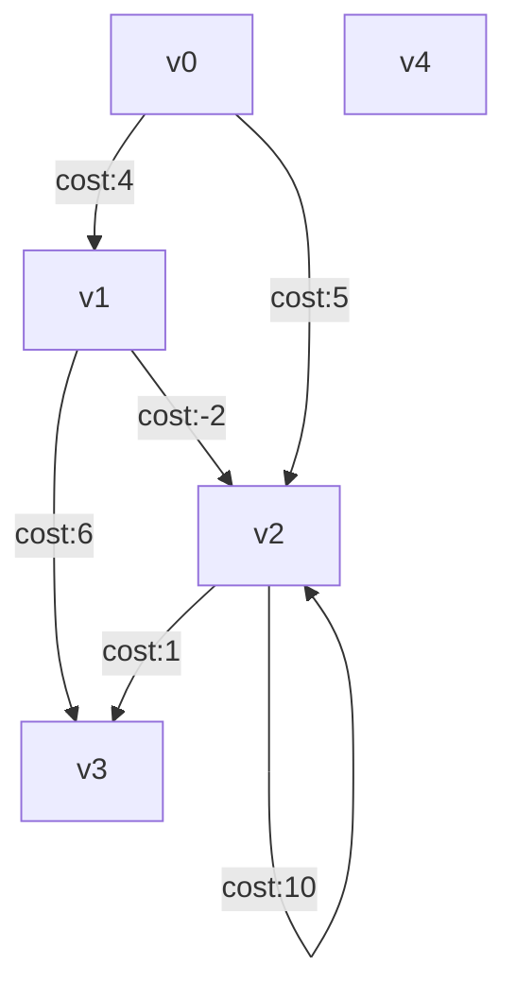
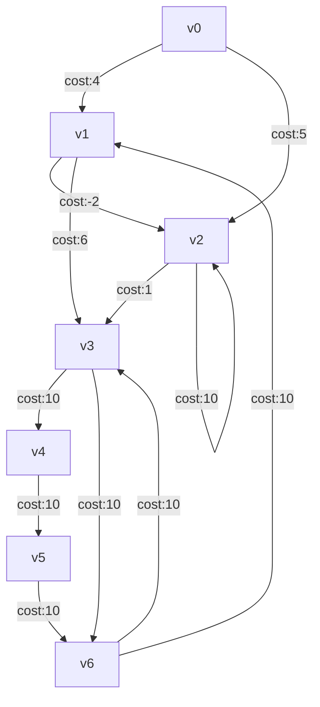

# DepthFirstFunctional
Simple depth first graph algorithm

## Tests

### Simple graph

Graph for `Depth First Simple` tests


ASCII Art (sucks)
```
    (v0)
    /  \
  4/    \5
  /      \
*        *
(v1)----*(v2)----|(v4)
  \  -2  / *_____|
  6\    /1    10
    \  /
     **
    (v3)
```     

### More Complex 7 Vertex Graph

Graph for `Depth First Moderate` tests



## Future Work

Support loading a graph from a JSON representation, for example [GraphSON](https://tinkerpop.apache.org/docs/3.4.1/dev/io/).  GraphML is another option.

Support loading a graph from a (relay based) GraphQL response.

Support loading a graph from a Mermaid specfication


